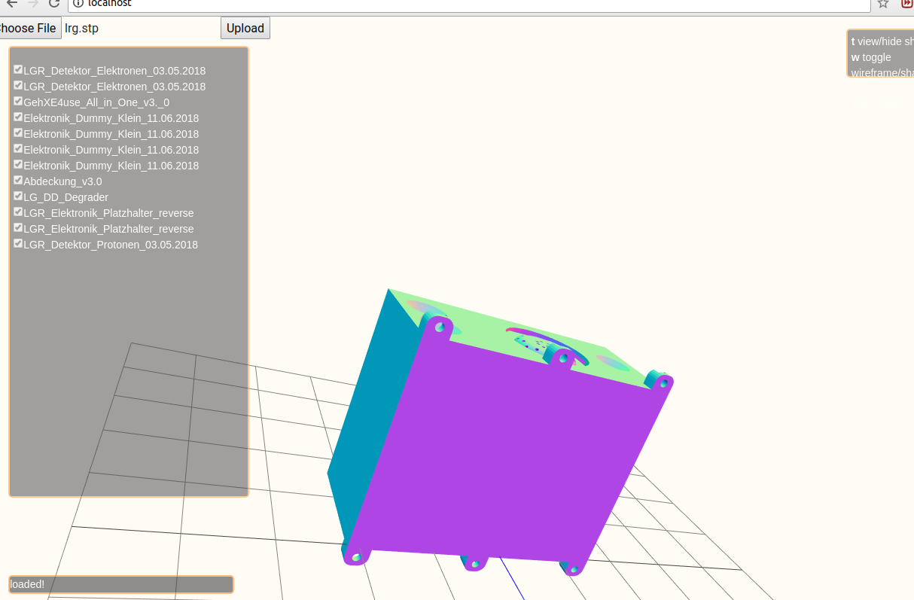

# WebCADViewer
A sever side web CAD file viewer using three.js, Flask and FreeCAD.  
Supported CAD formats:
-STEP
-Inventor iv
-IGES
-OBJ
-PLY
-VRML 
-DAE
-POLY
-BREP
-STL

It should work in Linux. 

# Dependencies:

- FreeCAD
  apt-get install FreeCAD
- python libraries:
   pip install werkzeug, flask,numpy, Pyside
   
# How to run:
python routes.py 

# Contact:
Hualin Xiao 
dr.hualin.xiao@gmail.com
hualin.xiao@psi.ch

# Screenshot

